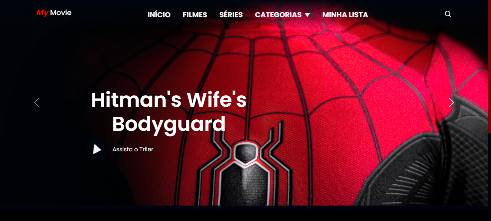
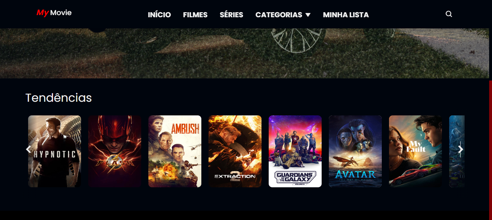

# my-movie

##  📋 Índice

- <a href="#sobre-o-projeto">Sobre o Projeto</a>
- <a href="#objetivos">Objetivos</a>
- <a href="#funcionalidades">Funcionalidades</a>
- <a href="#captura-de-tela">Capitura de Tela</a>
- <a href="#linguagens-utilizadas">Linguagens utilizadas</a>
- <a href="#o-que-eu-aprendi">O que eu aprendi</a>
- <a href="#recursos-úteis">Recursos úteis</a>
- <a href="#autor">Autor</a>

##  Sobre o Projeto

 Neste projeto eu trago imagens de filmes através de uma API do Site - <a href="https://www.themoviedb.org/">themoviedb.org</a> para o carrosel onde os filmes são exibidos, fiz a requisição de dados dos filmes usando a biblioteca Axios que permite fazer solicitações HTTP facilmente. 

##  Objetivos

- Ganhar mais conhecimento em JavaScript.
- Trabalha com API.
- Exercitar Bootstrap.
- Aprender mais sobre APIs.

## Funcionalidades

1. Pegar dados da API TMDB
2. Carousel slide
3. Carousel de Filmes
4. Pre Loading

## Captura de tela 
📸

#### Menu inicial e Carousel Slider

#### Carousel de Filmes

## Demonstração

[Link Demontração](<a href="https://cdnjs.cloudflare.com/ajax/libs/axios/1.4.0/axios.js">My Movie</a>)

## Linguagens utilizadas
📝
HTML | CSS, Bootstrap | JavaScript

###  O que eu aprendi
🤓

- Fazer o consume de dados de uma API, manipulando a URL para trazer os dados até a tela.

## Melhorias na alicação

- Melhorar a Responsividade
- Trazer os nomes do filme em protuguês
- Colocar titulo no carrosel
- trazer os filmes e videos para o carousel principal

## Lista de possíveis implementações

1. login de usuário
2. Modal com detalhes do filme
3. Adicionar aos Favoritos
4. Tratar da Responsividade

###   Recursos Úteis
🔧
- <a href="https://cdnjs.cloudflare.com/ajax/libs/axios/1.4.0/axios.js">Axios Js CDN</a>
- <a href="https://axios-http.com/docs/intro">Axios Js Docs</a>
- <a href="https://www.toptal.com/designers/htmlarrows/">htmlarrows</a>
- <a href="https://lordicon.com/">Icons by Lordicon.com</a>

- <a href="https://www.themoviedb.org/">The Movie DB</a>

- <a href="https://boxicons.com/?query=">Box Icons</a>
- <a href="https://getbootstrap.com/docs/5.3/components/carousel/">Carousel Bootstrap</a>
- Use a URL abaixo para trazer imagens no card, slider... passe o tamanho da imagem e depois do sinal de interrogação o tema da imagem que tu quer como car, movie, peaple, etc...
- https://source.unsplash.com/random/2560x1080/?model

##   Autor
🧑‍💻

### Vanderlei Junior
- <a href="https://github.com/VanderleiGeronimoJunior">GitHub</a>
- <a href="https://www.linkedin.com/in/vanderlei-junior-b9956686/">Linkedin</a>

